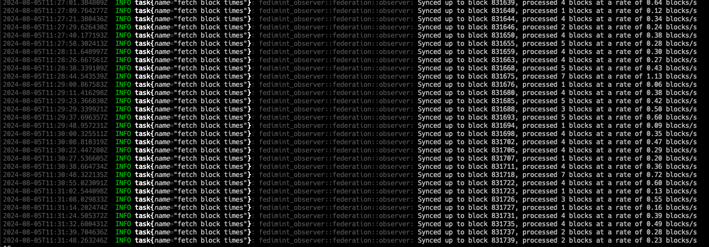

## Extra Challenge 1
Grrrr...I ran out of time.  

I was able to get the FO up and running but the syncing process was excruciatingly slow, despite me having a better than average internet connection.  

How slow?  This slow:

Not even 1 block per second!  And only for 2 pieces of information per block???

The effective sync rate steady stated at just under 20 blocks per MINUTE.  That means it would've taken nearly 30 hours just to populate the `block_times` table.

Apparently, I'm [preaching to the choir](https://github.com/douglaz/fedimint-observer/blob/master/src/federation/observer.rs#L154):
>        // TODO: find a better way to pre-seed the DB so we don't have to bother
>        // blockstream.info Block 820k was mined Dec 2023, afaik there are no
>        // compatible federations older than that