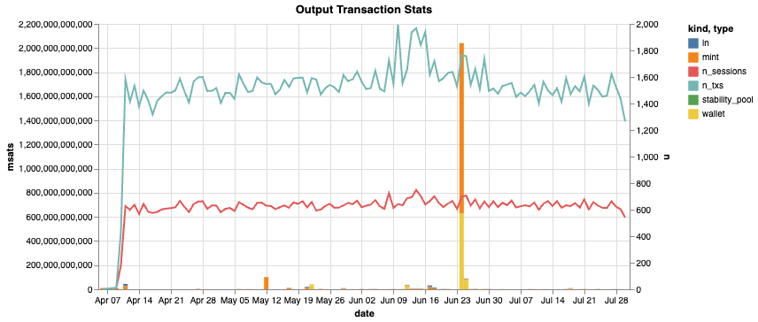

## Extra Challenge 2

### Database structure

The FO database comprises 9 tables:
1. `block_height_votes`
2. `block_times`
3. `federations`
4. `ln_contracts`
5. `session_times`
6. `sessions`
7. `transaction_inputs`
8. `transaction_outputs`
9. `transactions`

There are only two tables that contain money fields:  `transaction_inputs` and `transaction_outputs`.  Both contain an `amount_msats` field that represents the amount of millisatoshis (1,000 millisatoshis = 1 satoshi).

Timestamps for the transactions are found in `session_times` via `transactions`.

`block_times` also contains a `timestamp` field but the only other field is `block_height`, which doesn't exist in any other table.  (Though it is used to create `session_times` in the schema.)  

### Insights overview

* number of federations (1)
* number of guardians per federation (4)
* date range of the transaction data (4/6/2024 - 7/30/2024)
* number of transaction `kind`s (4: `ln`, `mint`, `stability_pool`, `wallet`) 
* flow of money from one `kind` to another (only 7 of the 4 * 4 = 16 possible paths exist)
* some output transactions involve multiple `kinds` (`mint` is always one of them)
* all input transactions only have one `kind`

### Oddities
#### *Rogue* transactions
Every transaction should be balanced.  That is, the sum of the input sats should equal the sum of the output sats.  However, there are 11 transactions where this is not the case.  They all involve `stability_pool`.

#### *Orphaned* transactions
Every transaction should have at least one input and one output.  There are 243 input transactions without a corresponding output.  On the output side, there are 34,975 output transactions without a corresponding input.  Thankfully, all of these transactions have `amount_msat = 0`.

#### Something big happened on June 24, 2024
Look at the ginormous bar spike:

What it looks like without that spike:

#### Simultaneous blocks
Curiously, eight different `timestamp` values are associated with two different `block_height` values, indicating two blocks were mined in the same second on eight different occasions. This is *not* a data duplication issue as two additional online bitcoin timechain explorers confirm the those timestamps ([mempool.space](https://mempool.space/block/000000000000000000022ec1dfcd42240bad8d3383b46ef7442782602ece107b) and [blockchain.com](https://www.blockchain.com/explorer/blocks/btc/832145)).

#### Mint power of 2
My favorite discovery.  Every amount minted is a power of 2.

### Additional observations
For the unsatiated, the are plenty more observations made in `tx_observations.ipynb` and `non_tx_observations.ipynb`.

Plus, that is where you can see the code to generate the aforementioned observations.
